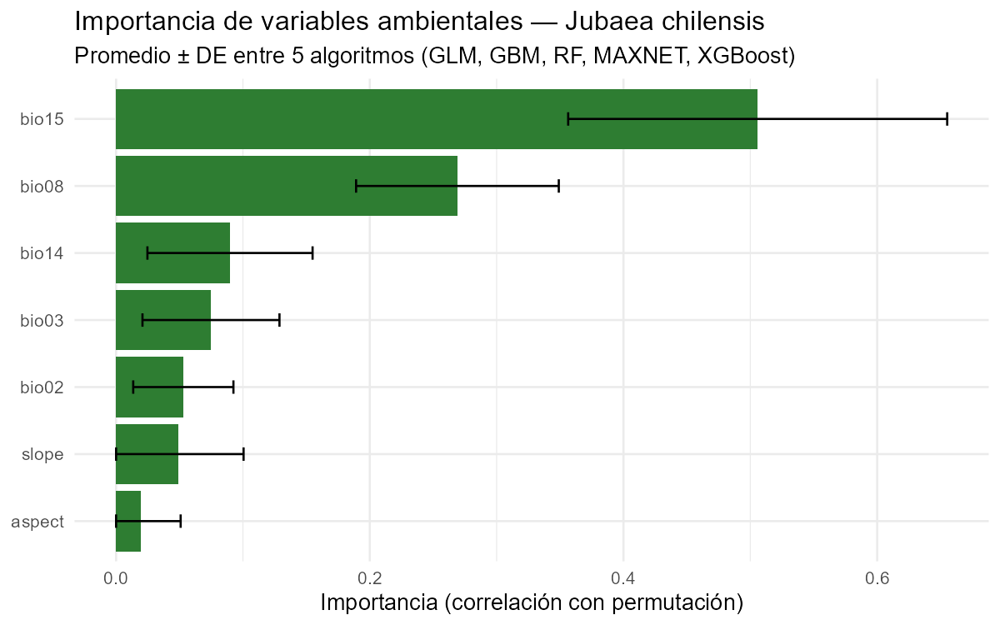
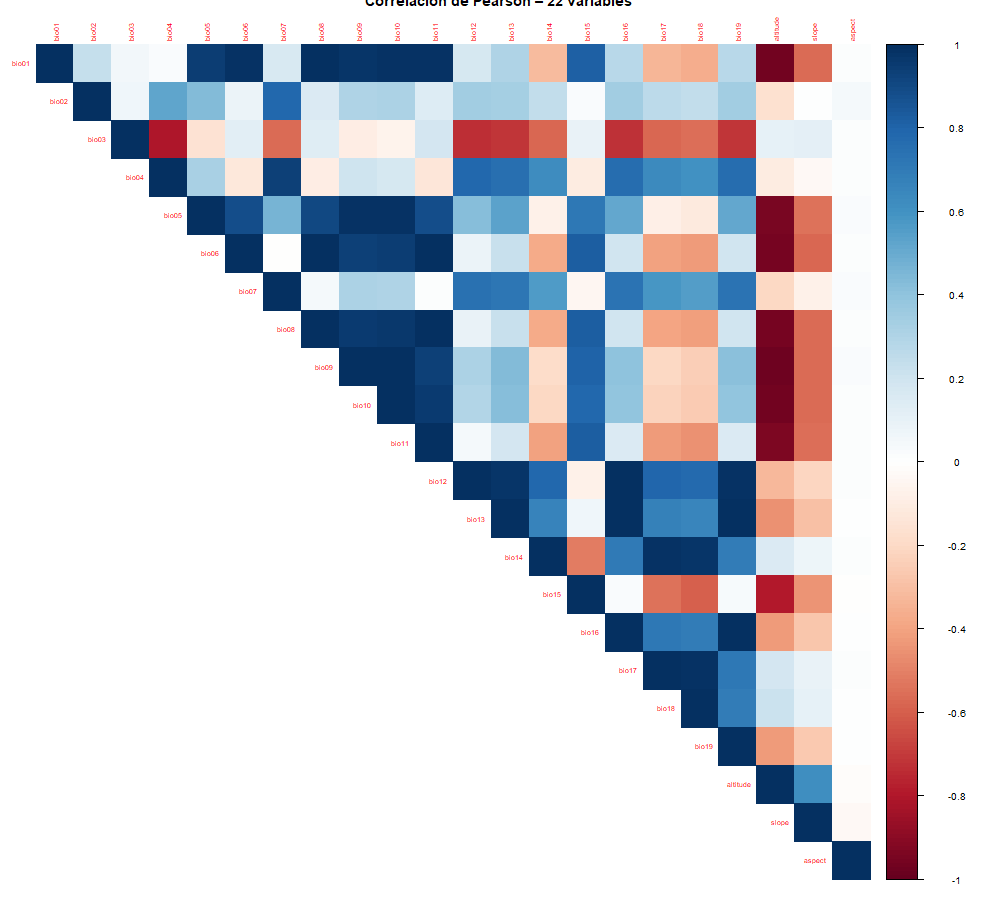
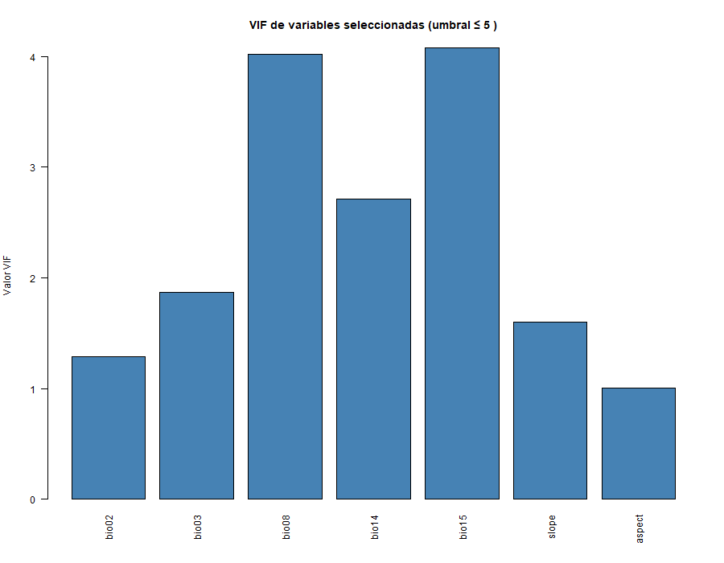
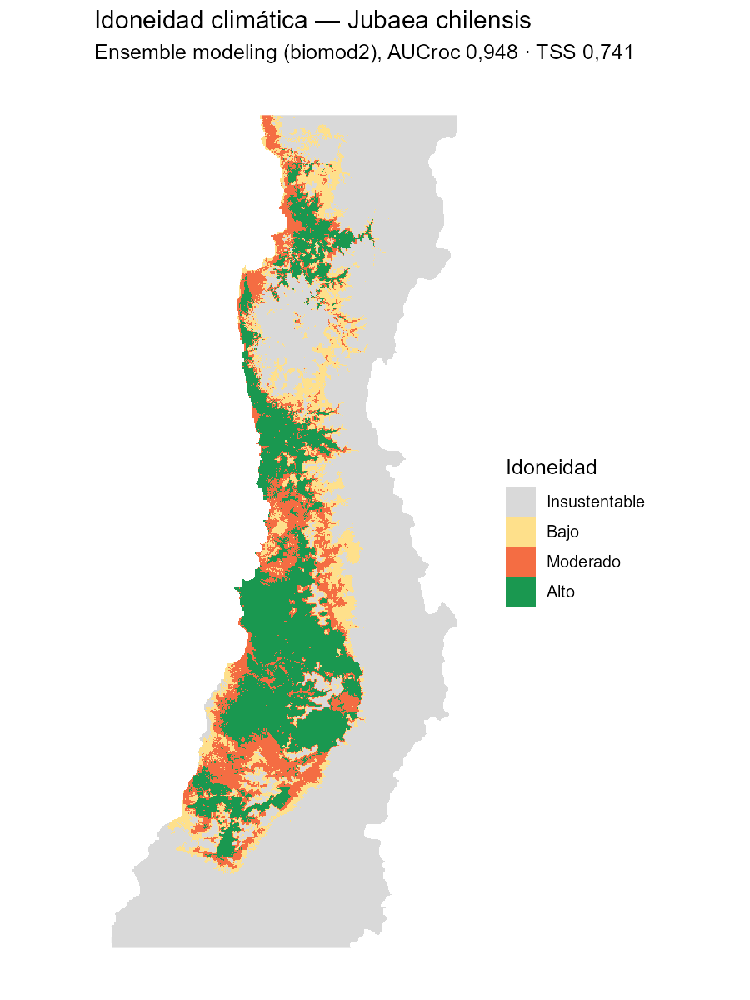
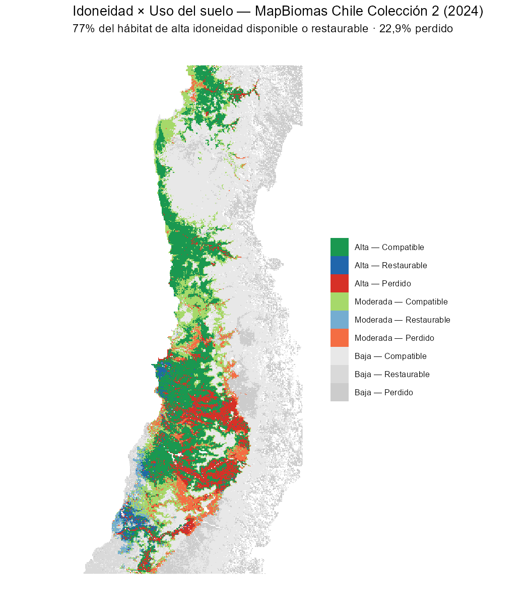
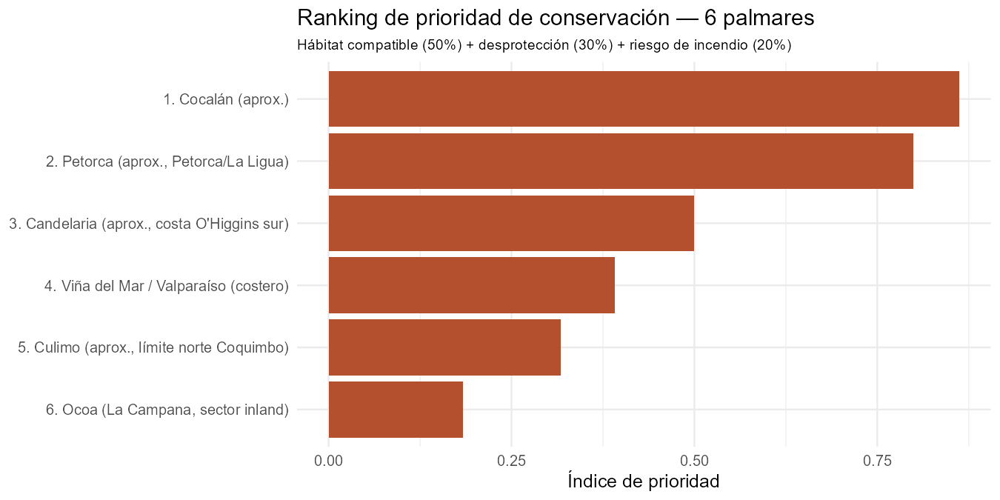
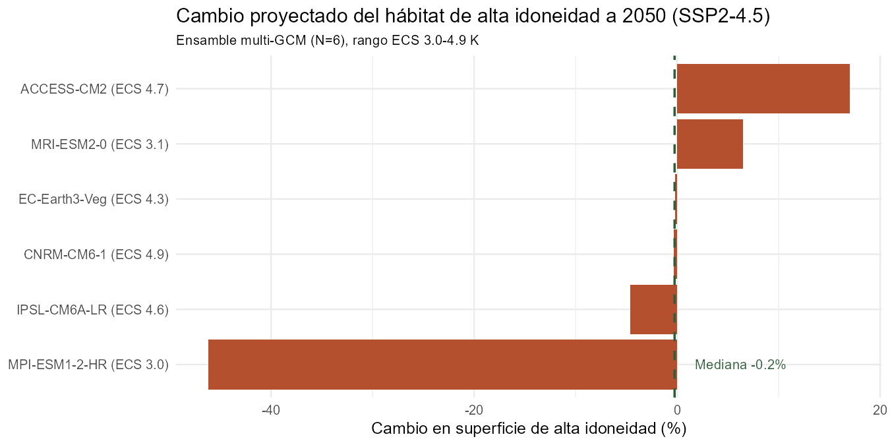

# Memoria Técnica - Premio MapBiomas Chile 2026 (1.ª Edición)

## 1. Título del Proyecto
**Idoneidad climática y disponibilidad real de hábitat para *Jubaea chilensis* (Palma chilena) mediante la integración de modelado de nicho ecológico con tres productos de MapBiomas Chile: cobertura de suelo, áreas protegidas y fuego.**

## 2. Autor(es)
Darío Nicolás Sánchez Leguizamón (pipeline desarrollado originalmente bajo Beca BIEI 2025 | Proyecto ARG/19/G24 | Red ARGENA; extensión a Chile desarrollada de forma independiente)

**Código fuente y ciencia abierta (requisito de elegibilidad N.º 8):** todo el código (R, Python, scripts de extracción vía Google Earth Engine) utilizado en este análisis es público, bajo licencia MIT, en:

**[github.com/sdarionicolas-boop/ENM-BGEN — carpeta extensiones/chile](https://github.com/sdarionicolas-boop/ENM-BGEN/tree/main/extensiones/chile)**

(repositorio completo: [github.com/sdarionicolas-boop/ENM-BGEN](https://github.com/sdarionicolas-boop/ENM-BGEN))

## 3. Resumen Ejecutivo
*Jubaea chilensis* (palma chilena) es una palmera endémica de Chile central catalogada como Vulnerable por la UICN, con estudios recientes (2024) que argumentan su reclasificación a En Peligro Crítico. De la población precolombina estimada, hoy solo subsisten ~121.284 individuos (2,5%), concentrados en seis palmares relictos entre La Serena y el Maule.

Este trabajo aplica el mismo pipeline de ensemble modeling (biomod2) ya utilizado para 19 especies del BGEN-UNAJ en Argentina y para *Mauritia flexuosa* en Perú, ahora sobre *Jubaea chilensis*, integrando tres capas complementarias: **MapBiomas Chile Colección 2 (2024)** — el producto de land cover exigido por el requisito de elegibilidad N.º 1 del reglamento del Premio — para cuantificar disponibilidad real de hábitat; el **WDPA/SNASPE** para medir qué fracción de ese hábitat está formalmente protegida; y el **Producto Fuego Colección 1** de MapBiomas Chile para cuantificar exposición histórica a incendios. Como anexo comparativo se incluye además el mismo cruce de cobertura con la Colección 1 (2022), lo que permite evaluar la sensibilidad metodológica del resultado entre versiones sucesivas del producto MapBiomas.

Los cruces convergen en un mensaje único: el 77% del hábitat climáticamente apto sigue disponible, pero solo el 12,6% está protegido, y ni siquiera la protección formal garantiza resguardo frente a incendios — un palmar protegido específicamente para la especie ("Palmar El Salto") perdió el 80% de su hábitat compatible al fuego entre 2013 y 2025. Una proyección a futuro (CMIP6, SSP2-4.5, 2041-2060, ensamble de 6 modelos climáticos globales — sección 6.8) agrega la dimensión más urgente, aunque no en la dirección que un primer modelo sugería: la mediana del ensamble es prácticamente neutra (-0,2%), pero el rango entre modelos es enorme (-46,2% a +17,0%), y esa incertidumbre —no una cifra puntual— es el hallazgo. No sabemos si el clima futuro reducirá, mantendrá o incluso ampliará el hábitat climáticamente apto; lo que sí sabemos, con certeza hoy, es que solo el 12,6% está protegido y que un palmar ya perdió el 80% de su hábitat al fuego. La estrategia de conservación no puede esperar a que esa incertidumbre climática se resuelva. Las métricas de validación del modelo de nicho (AUCroc 0,948, TSS 0,741) provienen de validación aleatoria sobre datos con autocorrelación espacial; una prueba de robustez con *thinning* espacial real y validación cruzada por bloques espaciales (sección 7) arroja resultados más conservadores (TSS medio 0,460, con el algoritmo MAXNET generalizando notablemente mejor que Random Forest), lo que se documenta con total transparencia sin alterar los resultados operativos del estudio.

## 4. Problema que Resuelve (Relevancia)
La literatura reciente atribuye el colapso poblacional de *Jubaea chilensis* a presión directa sobre los individuos (extracción de savia de palmeras decapitadas, sobrecosecha ilegal de semillas, depredación de semillas por *Rattus rattus* y de plántulas por conejos exóticos) más que a pérdida de hábitat por sí sola. Sin embargo, esta hipótesis no había sido contrastada cuantitativamente contra datos oficiales de cobertura de suelo.

Este estudio responde una pregunta concreta y accionable: **¿el hábitat climáticamente apto para la especie todavía existe como vegetación natural, o ya fue perdido por conversión de uso de suelo?** La respuesta determina si la estrategia de conservación debe priorizar la protección de individuos/semillas (si el hábitat está intacto) o además la restauración de hábitat (si está convertido).

## 5. Metodología

### 5.1. Datos de presencia
Se integraron 2.117 registros de ocurrencia de GBIF, filtrados al rango de distribución natural documentado en la literatura (29,9°S–35,3°S, franja costera mediterránea de Coquimbo a Maule), descartando 26 registros correspondientes a ejemplares cultivados fuera de rango (jardines y plazas, donde la especie se planta ampliamente como ornamental). Resultaron 2.091 registros válidos, sometidos a *thinning* espacial (1 registro por píxel).

### 5.2. Variables ambientales
19 variables bioclimáticas de WorldClim v2.1 y topografía SRTM (elevación, pendiente, aspecto) para Chile, reducidas mediante análisis VIF (≤5) para eliminar colinealidad.

### 5.3. Modelado de nicho ecológico (Ensemble Modeling)
Cinco algoritmos (GLM, GBM, RF, MAXNET, XGBoost) en R (`biomod2`), validación cruzada 80/20 con 3 repeticiones, ensamble ponderado por TSS. Métricas de validación:

| Métrica | Promedio | Rango |
|---------|----------|-------|
| AUCroc  | 0,948    | 0,925 – 0,974 |
| TSS     | 0,741    | 0,698 – 0,769 |

Ambas muy por encima de los umbrales de calidad del pipeline (TSS ≥ 0,7, AUCroc ≥ 0,9). **Estas métricas provienen de validación cruzada aleatoria sobre datos con autocorrelación espacial no corregida, lo que puede sobrestimarlas** — se realizó una prueba de robustez con *thinning* espacial real y validación por bloques espaciales, con resultados sustancialmente más conservadores (TSS medio 0,460); ver el análisis completo, la justificación de la decisión metodológica adoptada y el desglose por algoritmo en la sección 7 (Limitaciones).

**Importancia de variables** (promedio ± DE entre los 5 algoritmos, ya calculada durante el ajuste del modelo, sin reentrenamiento adicional):

| Variable | Importancia media | Descripción |
|---|---:|---|
| bio15 | 0,506 ± 0,149 | Estacionalidad de la precipitación (coeficiente de variación) |
| bio08 | 0,269 ± 0,080 | Temperatura media del trimestre más lluvioso |
| bio14 | 0,090 ± 0,065 | Precipitación del mes más seco |
| bio03 | 0,075 ± 0,054 | Isotermalidad |
| bio02 | 0,053 ± 0,040 | Rango diurno medio de temperatura |
| slope | 0,049 ± 0,051 | Pendiente |
| aspect | 0,019 ± 0,032 | Orientación |

**La estacionalidad de la precipitación (bio15) domina ampliamente la idoneidad climática de la especie** — más del doble de importancia que la segunda variable. Esto es coherente con el eje de "megasequía y valles centrales" que el propio reglamento del Premio identifica como dinámica crítica para Chile: *Jubaea chilensis* no responde tanto a cuánta lluvia cae en total, sino a qué tan irregular es su distribución estacional, la métrica que la megasequía altera de forma más directa.



*Diagnósticos adicionales de colinealidad (matriz de correlación de Pearson y VIF de las variables seleccionadas):*





### 5.4. Integración con MapBiomas Chile Colección 2 (2024)
El reglamento del Premio MapBiomas Chile 2026 (requisito de elegibilidad N.º 1) exige el uso del **"Producto land cover colección 2"**. A diferencia de Argentina y Perú, la Colección 2 de Chile (publicada en 2025, serie 1999-2024) **no está disponible como descarga directa en el bucket público** de MapBiomas — su acceso oficial es exclusivamente vía **Google Earth Engine**, mediante el asset:

```
projects/mapbiomas-chile/assets/LULC/COLLECTION-02/
  CLASSIFICATIONS/classification-final/clasificacion-final-2
```

Se extrajo la banda `classification_2024` para el área de interés mediante la API de Python de Earth Engine (autenticación OAuth propia), exportada en 10 teselas (por límite de tamaño de descarga directa de GEE) y mosaicada con `terra::merge()` en R.

La capa se reclasificó según la leyenda oficial de MapBiomas Chile en tres dimensiones operativas, siguiendo el mismo criterio ya aplicado a Argentina y Perú:

| Categoría | Clases MapBiomas Chile | Códigos |
|-----------|------------------------|---------|
| **Compatible** | Bosque, humedal, pastizal natural, estepa, matorral | 3, 59, 60, 67, 11, 12, 63, 66 |
| **Restaurable** | Silvicultura, pastura, mosaico agropecuario | 9, 15, 21 |
| **Incompatible** | Agricultura, infraestructura, área degradada | 18, 24, 25 |
| *Excluido* | Agua, hielo/nieve, afloramiento rocoso, arena/duna, salar, sin datos | 0, 23, 29, 33, 34, 61 |

La categoría *Excluido* agrupa superficies naturalmente no vegetadas (alta cordillera, cuerpos de agua) que quedan fuera del esquema de conversión antrópica y no se computan como "pérdida" — una precisión metodológica necesaria en un país con una fracción tan grande de su territorio en la criósfera y zonas áridas, a diferencia de Argentina o Perú.

Luego se realizó el cruce algebraico con la capa de idoneidad climática reclasificada (Alta/Moderada/Baja), obteniendo 9 combinaciones posibles por celda. Como anexo, se repitió el mismo procedimiento con **Colección 1 (2022)** (descarga directa pública) para evaluar la estabilidad temporal/metodológica del resultado (ver sección 6.4).

## 6. Resultados

### 6.1. Consistencia con sitios documentados en la literatura (no es validación independiente)

Se extrajo la idoneidad climática predicha dentro de cinco áreas protegidas asociadas a palmares reales de *Jubaea chilensis*, para verificar si el modelo reproduce alta idoneidad donde la especie está documentada:

| Sitio | Idoneidad media (prob.) | % superficie en clase "Alta" |
|---|---:|---:|
| Palmar El Salto | 0,788 | 100% |
| Área de Palma Chilena de Monte Aranda | 0,699 | 100% |
| La Campana – Peñuelas | 0,675 | 72,1% |
| Bosque Fray Jorge (RB) | 0,487 | 32,4% |
| Palmas de Cocalán | 0,453 | 33,3% |
| *Referencia: promedio en toda la AOI* | *0,249* | — |

**Aclaración metodológica importante:** en una primera versión de este documento esta sección se presentó como "validación externa independiente". Una revisión posterior detectó que eso era incorrecto: al cruzar los 2.091 registros de presencia usados para *entrenar* el modelo contra estos mismos cinco polígonos, se encontró que **el 72,6% de los registros de entrenamiento (1.519 de 2.091) caen dentro de ellos** —1.514 solo dentro de La Campana-Peñuelas—. Es decir, el modelo vio presencias reales de estos sitios durante el ajuste, por lo que encontrar alta idoneidad ahí después no es una prueba independiente de capacidad predictiva: es, en gran medida, circular.

Lo que esta tabla sí muestra honestamente es **consistencia interna**: el modelo no contradice la evidencia de terreno donde más presencias reales existen, lo cual es una condición necesaria (si el modelo predijera baja idoneidad exactamente donde sabemos que la especie vive y fue muestreada, eso sí sería una señal de alarma) pero no suficiente como evidencia de capacidad predictiva fuera de muestra. La validación estadística real de esa capacidad son las métricas de la sección 5.3 (AUCroc/TSS, validación cruzada 80/20) — que a su vez tienen su propia limitación, discutida en la sección 7.

### 6.2. Superficie de hábitat de Alta Idoneidad Climática — Colección 2 (2024, resultado oficial)



| Categoría | Superficie | % |
|-----------|-----------:|---:|
| Compatible (conservación) | 14.937 km² | 71,9% |
| Restaurable (restauración) | 1.058 km² | 5,1% |
| Incompatible (hábitat perdido) | 4.765 km² | 22,9% |
| **Total idoneidad alta** | **20.760 km²** | 100% |

**El 77% del hábitat climáticamente óptimo para *Jubaea chilensis* persiste como vegetación natural o es restaurable; el 22,9% fue efectivamente convertido.**



### 6.3. Interpretación
Este resultado es relevante porque, aun siendo más conservador que una primera exploración con datos de 2022 (ver sección 6.4), sigue indicando que **la mayor parte del hábitat climáticamente apto está disponible**. La brecha entre 121.284 individuos actuales y el hábitat potencial disponible (miles de km²) señala que el factor limitante no es únicamente la disponibilidad de tierra, sino también la presión directa documentada en la literatura: extracción de savia, sobrecosecha de semillas y depredación por fauna exótica que colapsa la dispersión y el reclutamiento de nuevos individuos. La conservación de esta especie requiere, por lo tanto, una estrategia combinada: proteger tanto el 22,9% de hábitat ya convertido de mayor conversión adicional como los individuos reproductivos remanentes.

### 6.4. Sensibilidad metodológica: comparación Colección 1 (2022) vs. Colección 2 (2024)

Como control de robustez, se repitió el cruce con la Colección 1 (2022), obteniendo un resultado más optimista (92% disponible/restaurable, 4,3% perdido). Para entender esta diferencia se realizó un **cruce píxel a píxel** entre ambas colecciones dentro de la zona de alta idoneidad climática, en vez de asumir que se trata de conversión real de hábitat en dos años.

**Hallazgo:** de los 8.646 píxeles clasificados como "Mosaico Agropecuario" (código 21, categoría Restaurable) en Colección 1, la Colección 2 —que discontinuó esa clase ambigua y reclasifica con mayor granularidad— asigna esos mismos píxeles físicos a:

| Destino en Colección 2 | Píxeles | % | Categoría resultante |
|---|---:|---:|---|
| Agricultura (18) | 4.894 | 56,6% | Incompatible |
| Matorral (66) | 2.785 | 32,2% | Compatible |
| Pastizal (12) | 301 | 3,5% | Compatible |
| Infraestructura (24) | 217 | 2,5% | Incompatible |
| Pastura (15) | 172 | 2,0% | Restaurable |
| Silvicultura (9) | 109 | 1,3% | Restaurable |

El aumento neto de "hábitat perdido" entre colecciones es de 5.361 píxeles; **5.111 de ellos (95,3%) provienen directamente de esta reclasificación de la clase mosaico**, no de conversión real de uso de suelo ocurrida entre 2022 y 2024. Es decir: la Colección 2 no muestra que Chile perdió hábitat de palma en dos años — muestra que una fracción de lo que antes se veía como "uso mixto/restaurable" ambiguo es, con mayor resolución de clasificación, agricultura activa. Este es un resultado más preciso, no un empeoramiento del hábitat.

Esta comparación se documenta también en el archivo de datos *crosstab_col1_col2_alta_idoneidad.csv*.

### 6.5. Brecha de protección: ¿cuánto del hábitat disponible está protegido?

El resultado de la sección 6.2 responde "cuánto hábitat hay disponible", pero no "cuánto de ese hábitat está legalmente resguardado de conversión futura". Para responder esto se cruzó la capa "Compatible × Alta idoneidad" (14.937 km²) con el **WDPA (World Database on Protected Areas, UNEP-WCMC/IUCN)**, filtrado a las 76 áreas protegidas de Chile que intersectan la AOI (Parques Nacionales, Reservas Nacionales y Monumentos Naturales del SNASPE/CONAF, Santuarios de la Naturaleza del MMA, sitios Ramsar y Reservas de la Biósfera UNESCO-MAB), obtenido vía Google Earth Engine.

| Categoría | Superficie | % |
|---|---:|---:|
| Compatible, alta idoneidad — **protegido** | 1.889 km² | 12,6% |
| Compatible, alta idoneidad — **desprotegido** | 13.048 km² | 87,4% |

**Solo el 12,6% del hábitat climáticamente óptimo y aún disponible está dentro de un área protegida. El 87,4% restante no tiene ninguna figura de protección legal** y queda expuesto a la misma presión agrícola que ya convirtió el 22,9% del hábitat históricamente apto (sección 6.2).

El detalle por área protegida (tabla completa en *snaspe_detalle_por_area.csv*) confirma además la validez del modelo: las áreas que concentran más hábitat compatible son exactamente los sitios documentados en la literatura como palmares relictos —

| Área protegida | Hábitat compatible |
|---|---:|
| Parque Nacional La Campana – Peñuelas | 1.358 km² |
| Reserva de la Biósfera Bosque Fray Jorge | 397 km² |
| Reserva Nacional Lago Peñuelas | 76 km² |
| Palmas de Cocalán | 10 km² |
| Área de Palma Chilena de Monte Aranda | 5 km² |
| Palmar El Salto | 4 km² |

— es decir, el modelo de idoneidad climática predice alta idoneidad justo donde existen áreas protegidas creadas específicamente para esta especie ("Palmas de Cocalán", "Área de Palma Chilena de Monte Aranda", "Palmar El Salto"), lo que refuerza la interpretación de consistencia interna ya discutida en la sección 6.1 (con la misma aclaración: esos sitios aportaron registros al entrenamiento, así que no constituyen validación independiente en sentido estadístico).

**Implicancia para gestión territorial:** la prioridad de conservación no es solo evitar más conversión de uso de suelo, sino ampliar la red de protección formal sobre el 87,4% de hábitat compatible que hoy no tiene ninguna figura legal — particularmente fuera de los núcleos ya protegidos de La Campana-Peñuelas y Fray Jorge.

### 6.6. Incendios: un tercer producto MapBiomas Chile aplicado al mismo hábitat

El reglamento del Premio también habilita el **Producto Fuego Colección 1** como fuente de datos elegible. Se utilizó la capa de **frecuencia de área quemada acumulada 2013-2025** (descarga directa pública desde el bucket oficial de MapBiomas, el 20 de septiembre de 2026) para cuantificar cuánto del hábitat compatible de alta idoneidad ya fue afectado por incendios — la misma amenaza que la literatura (sección 4) identifica como recurrente para la especie, ahora con datos espaciales concretos en vez de solo referencia bibliográfica.

**Verificación de completitud del año 2025.** Se descargaron los rasters anuales del producto Fuego (`annual_burned_v1`) para el período 2018-2025 y se contó la superficie quemada dentro de la AOI de *Jubaea chilensis* por año (script `BLOQUE7c_bis_verificacion_fuego_2025.R`):

| Año | Superficie quemada en la AOI |
|---|---:|
| 2018 | 119 km² |
| 2019 | 89 km² |
| 2020 | 224 km² |
| 2021 | 266 km² |
| 2022 | 213 km² |
| 2023 | 128 km² |
| 2024 | 178 km² |
| **Media 2018-2024** | **174 km²/año** |
| 2025 | **8,6 km²** (5% del promedio histórico) |

**El año 2025 está claramente incompleto** en la Colección 1 al momento de la descarga: registra solo un 5% de la superficie quemada anual promedio de los 7 años previos, orden de magnitud por debajo del más bajo del período (89 km² en 2019). Considerando que la temporada de incendios en Chile central es diciembre-marzo, es probable que el dataset cortó a mitad de 2025 sin la temporada 2025/26. En consecuencia, las cifras de esta sección (8,3% de hábitat compatible quemado; 80% en Palmar El Salto) representan el período **2013 hasta ~mediados de 2025**, no un período 2013-2025 completo. Un año 2025 completo probablemente aumentaría marginalmente la superficie quemada total; el hallazgo cualitativo (Palmar El Salto tiene una tasa de quema anómalamente alta) es robusto porque se mantiene si se restringe el análisis a 2013-2024.

| Estado de protección | Hábitat compatible | Quemado alguna vez (2013-2025) | % quemado |
|---|---:|---:|---:|
| Desprotegido | 13.048 km² | 1.010 km² | 7,7% |
| Protegido | 1.889 km² | 234 km² | 12,4% |
| **Total** | **14.937 km²** | **1.245 km²** | **8,3%** |

**Hallazgo relevante:** las áreas *protegidas* se quemaron proporcionalmente **más** que las desprotegidas (12,4% vs 7,7%). Esto no es contradictorio: la vegetación nativa continua que predomina dentro de las áreas protegidas (matorral, bosque esclerófilo) constituye mayor carga de combustible que el mosaico agrícola/urbano circundante. La implicancia práctica es directa: **la protección legal por sí sola no equivale a protección contra incendios** — se requiere manejo activo del combustible y cortafuegos dentro del propio sistema de áreas protegidas, no solo ampliar su superficie.

El detalle por área protegida (tabla completa en *fuego_por_area_protegida.csv*) identifica un caso crítico puntual:

| Área protegida | Hábitat compatible | % quemado 2013-2025 |
|---|---:|---:|
| **Palmar El Salto** | 3,6 km² | **80%** |
| Quebrada de La Plata | 1,4 km² | 50% |
| Lago Peñuelas | 75,8 km² | 44,8% |
| Cerro Santa Inés | 7,2 km² | 20% |
| La Campana – Peñuelas | 1.358 km² | 14,3% |
| Palmas de Cocalán | 10,1 km² | 14,3% |
| Fray Jorge, Monte Aranda, Roblería del Cobre, San Juan de Piche | — | 0% |

**"Palmar El Salto"** —una reserva creada específicamente para *Jubaea chilensis*— tuvo el **80% de su hábitat compatible quemado** en el período analizado. Es el hallazgo más urgente y accionable de este estudio: identifica un sitio puntual, pequeño y con nombre propio donde la intervención de manejo de fuego debería priorizarse de inmediato, en contraste con palmares como Fray Jorge o Monte Aranda que no registran quemas en el mismo período y podrían servir de referencia de buen manejo.

### 6.7. Ranking de palmares por prioridad de conservación

La literatura (PMC9370131) documenta seis poblaciones/palmares principales —Ocoa, Cocalán, Viña del Mar/Valparaíso, Candelaria, Petorca y Culimo— que concentran el 96% de los individuos, pero no publica sus coordenadas exactas en formato tabulado. Para construir un ranking accionable sin inventar límites administrativos, se agruparon los 2.091 registros de presencia mediante **clustering espacial (k-means, k=6)** y se calculó, para cada clúster, un índice de prioridad de conservación análogo al usado en `BLOQUE8_partidos_bonaerenses.R` (Argentina): combina hábitat compatible disponible (peso 50%), grado de desprotección (peso 30%) y exposición a incendios (peso 20%).

**Advertencia metodológica:** el valor k=6 se fijó porque la literatura reporta seis poblaciones, no porque un criterio estadístico independiente (p. ej. silueta, gap statistic) haya indicado que 6 es el número óptimo de agrupamientos en los datos. Esto es circular en sentido estricto: se usa el resultado esperado para fijar un parámetro del método. Además, k-means no respeta necesariamente la estructura ecológica real (dos palmares cercanos pueden fusionarse en un clúster, uno extenso puede partirse en dos). Por lo tanto, **los seis "palmares" de esta sección son agrupamientos espaciales operativos, no unidades poblacionales validadas genéticamente** — de ahí que cada uno se etiquete con un nivel de confianza explícito (Alta/Media/Baja) en vez de asumirse como identificación certera.

Cada clúster se etiquetó con la población documentada más cercana, indicando explícitamente el nivel de confianza de esa identificación (por coincidencia con polígonos WDPA conocidos, o por toponimia regional cuando no hay una referencia espacial exacta):

| Rango | Palmar (aprox.) | Confianza | Hábitat compatible | % Protegido | % Quemado | Índice prioridad |
|---|---|---|---:|---:|---:|---:|
| 1 | Cocalán | Media | 2.646 km² | 1,3% | 13,0% | 0,862 |
| 2 | Petorca | Media | 2.798 km² | 0,3% | 0% | 0,799 |
| 3 | Candelaria | Baja | 501 km² | 0% | 25,6% | 0,500 |
| 4 | Viña del Mar/Valparaíso | Alta | 1.120 km² | 38,9% | 18,0% | 0,391 |
| 5 | Culimo | Media | 581 km² | 0% | 0% | 0,317 |
| 6 | Ocoa (La Campana) | Alta | 1.074 km² | 63,2% | 7,6% | 0,184 |



**Ocoa queda en el último lugar de prioridad** precisamente porque ya está mayoritariamente protegida (63,2%, dentro del Parque Nacional La Campana-Peñuelas) — es la población que menos necesita intervención adicional. **Cocalán y Petorca encabezan el ranking**: concentran mucho hábitat compatible con protección casi nula, y deberían ser el foco de nuevas iniciativas de conservación formal. El clúster "Viña del Mar/Valparaíso" merece una salvedad: al coincidir con una zona urbana densamente muestreada por ciencia ciudadana (iNaturalist), su alto número de registros (1.422, el mayor de los seis) probablemente incluye ejemplares cultivados en plazas y jardines, no solo poblaciones silvestres — la misma limitación de sesgo de muestreo urbano discutida en la sección 5.1.

Tabla completa con centroides y metodología de etiquetado en *ranking_palmares.csv*.

**Sensibilidad a los pesos del índice.** Los pesos 50/30/20 no tienen una justificación teórica externa — son una elección razonable pero arbitraria. Para probar si el ranking depende de esa elección específica, se recalculó el índice con cuatro esquemas alternativos de ponderación:

| Palmar | 50/30/20 (original) | 40/40/20 | 60/20/20 | 33/33/33 (igual) | 70/15/15 (solo hábitat) |
|---|---:|---:|---:|---:|---:|
| Cocalán | 1 | 1 | 1 | 1 | 1 |
| Petorca | 2 | 2 | 2 | 3 | 2 |
| Candelaria | 3 | 3 | 3 | 2 | 4 |
| Viña del Mar/Valparaíso | 4 | 5 | 4 | 4 | 3 |
| Culimo | 5 | 4 | 5 | 5 | 6 |
| Ocoa (La Campana) | 6 | 6 | 6 | 6 | 5 |

**El resultado es robusto donde más importa: Cocalán es el #1 y Ocoa es el #6 (última prioridad) bajo los cinco esquemas de ponderación probados, sin excepción.** El único lugar donde el ranking cambia es el #2: Petorca lo ocupa en 4 de 5 esquemas, pero bajo ponderación estrictamente igualitaria (33/33/33) Candelaria lo desplaza. Las posiciones intermedias (4ª-5ª) muestran algo más de variación. En síntesis: la recomendación de máxima prioridad (Cocalán) y la de menor prioridad (Ocoa) no dependen de la elección de pesos; la recomendación secundaria (Petorca vs. Candelaria) sí tiene algo de sensibilidad y debe leerse con ese margen de incertidumbre. Detalle completo en *sensibilidad_pesos_ranking.csv*.

### 6.8. Proyección a futuro: cambio climático (CMIP6, 2050, SSP2-4.5, ensamble de 6 GCMs)

Todos los resultados anteriores describen el presente. Como último análisis, se proyectó el ensemble ya entrenado (sin reentrenar) sobre un escenario climático futuro, SSP2-4.5 (emisiones moderadas), horizonte 2041-2060, manteniendo fijas las variables topográficas (pendiente, orientación) y actualizando las 5 variables bioclimáticas retenidas por VIF (bio02, bio03, bio08, bio14, bio15) a sus valores proyectados por WorldClim.

**Un primer resultado, con un único GCM (MPI-ESM1-2-HR), sugirió una caída dramática del 46,2% en la superficie de alta idoneidad.** Antes de reportar esa cifra como hallazgo, se puso a prueba: ¿qué tan sensible es al modelo climático específico elegido? La práctica estándar en estudios de impacto climático es no confiar en un solo GCM, precisamente porque distintos modelos pueden proyectar cambios de magnitud —e incluso signo— muy distintos para la misma región. Se repitió el mismo procedimiento con un **ensamble de 6 GCMs** que cubre el rango plausible de sensibilidad climática (ECS, *Equilibrium Climate Sensitivity*) del IPCC AR6, evitando tanto los modelos "calientes" señalados por la literatura como atípicos (ECS > 5 K) como el extremo opuesto (ECS < 2 K): MPI-ESM1-2-HR (ECS 3,0), MRI-ESM2-0 (3,1), EC-Earth3-Veg (4,3), IPSL-CM6A-LR (4,6), ACCESS-CM2 (4,7) y CNRM-CM6-1 (4,9).

**El resultado cambia por completo la lectura.** MPI-ESM1-2-HR resultó ser un caso atípico severo dentro del propio ensamble, no un valor representativo:

| GCM | ECS (K) | Alta idoneidad actual | Alta idoneidad 2050 | Cambio |
|---|---:|---:|---:|---:|
| MPI-ESM1-2-HR | 3,0 | 21.307 km² | 11.467 km² | **-46,2%** |
| MRI-ESM2-0 | 3,1 | 21.307 km² | 22.687 km² | +6,5% |
| EC-Earth3-Veg | 4,3 | 21.307 km² | 21.255 km² | -0,2% |
| IPSL-CM6A-LR | 4,6 | 21.307 km² | 20.333 km² | -4,6% |
| ACCESS-CM2 | 4,7 | 21.307 km² | 24.926 km² | +17,0% |
| CNRM-CM6-1 | 4,9 | 21.307 km² | 21.245 km² | -0,3% |

| Estadística del ensamble (N=6) | Valor |
|---|---:|
| Mediana | **-0,2%** |
| Rango intercuartílico (IQR) | -3,5% a +4,8% |
| Rango completo | -46,2% a +17,0% |
| Media (afectada por el outlier MPI-ESM1-2-HR; se reporta por completitud, la mediana es la lectura recomendada) | -4,6% |



**La mediana del ensamble es prácticamente neutra (-0,2%), muy lejos del -46,2% que un único modelo había sugerido.** Cinco de los seis GCMs (todos salvo MPI-ESM1-2-HR) coinciden en un cambio moderado, entre -4,6% y +17,0% — ninguno de ellos reproduce una contracción severa. MPI-ESM1-2-HR es, dentro de este ensamble, el modelo más pesimista con una diferencia sustancial respecto al resto, y no hay una justificación climática regional para tratarlo como el escenario más probable: de hecho, **no hay correlación entre la sensibilidad climática global (ECS) de cada modelo y la magnitud del cambio proyectado** — MPI-ESM1-2-HR (ECS 3,0) y MRI-ESM2-0 (ECS 3,1) tienen ECS casi idéntica pero resultados opuestos (-46,2% vs. +6,5%), mientras que ACCESS-CM2 (ECS 4,7, el segundo más alto del ensamble) proyecta el mayor aumento (+17,0%). Esto indica que la dispersión del ensamble responde a cómo cada modelo resuelve la dinámica climática regional de Chile central, no a un gradiente simple de "más calentamiento global = más pérdida de hábitat" — lo que refuerza que la incertidumbre no se resuelve simplemente prefiriendo el modelo más o menos sensible. Reportar solo la cifra de MPI-ESM1-2-HR —como se hizo en una versión preliminar de este análisis— habría comunicado una falsa certeza sobre la dirección del cambio climático proyectado para esta especie.

**Lo que el ensamble sí muestra con claridad es alta incertidumbre inter-modelo**, y esa incertidumbre —no una cifra puntual de pérdida— es en sí misma el hallazgo relevante para la conservación: bajo el estado actual del conocimiento climático, no es posible afirmar si el hábitat climáticamente apto para *Jubaea chilensis* se va a contraer, mantener o incluso expandir hacia 2050. Diseñar una estrategia de conservación que dependa de que se cumpla el escenario más pesimista (o el más optimista) sería apostar a un resultado que el propio ensamble no respalda. La lectura correcta es la inversa: frente a esa incertidumbre, lo que hay que proteger es lo que **hoy** se sabe con certeza — apenas el 12,6% del hábitat disponible está protegido (sección 6.5), y un palmar protegido específicamente para la especie ya perdió el 80% de su hábitat al fuego (sección 6.6). Esas cifras no dependen de ningún escenario climático futuro y no van a esperar a que la incertidumbre del CMIP6 se resuelva.

Un cruce adicional entre los refugios climáticos que persistirían en 2050 bajo MPI-ESM1-2-HR (el escenario más conservador disponible) y el uso de suelo **actual** matiza aún más el panorama: del área que seguiría siendo de alta idoneidad en 2050 bajo ese escenario, el 75,1% es hoy vegetación natural disponible, pero el **22,3% ya está convertido** — es decir, incluso en el escenario climático más pesimista del ensamble, una porción significativa de los futuros refugios climáticos ya no sería utilizable por la especie, independientemente de qué ocurra con el clima. Esto refuerza la urgencia de proteger hábitat compatible *ahora*: parte de lo que el clima futuro seguiría permitiendo, el uso de suelo presente ya lo está descartando.

Detalle completo en *cambio_idoneidad_2050.csv* (resultado MPI-ESM1-2-HR original), *cambio_idoneidad_2050_multiGCM.csv* (los 6 GCMs), *cambio_idoneidad_2050_estadisticas.csv* (mediana/IQR/rango) y *refugios_2050_uso_actual.csv*. Script: *BLOQUE15_multi_GCM.R*.

### 6.9. Visualización de resultados

Todos los mapas y gráficos de este documento tienen su versión interactiva y sus datos de origen publicados en la carpeta `extensiones/chile/resultados/` del repositorio (ver enlace en la sección 2):

| Contenido | Archivo |
|---|---|
| Visor interactivo de idoneidad climática | `mapa_interactivo_jubaea_chile.html` |
| Visor interactivo del cruce, Colección 2 (oficial) | `Col2_2024/mapa_interactivo_cruce_chile.html` |
| Visor interactivo del cruce, Colección 1 (anexo) | `Col1_2022/mapa_interactivo_cruce_chile.html` |
| Brecha de protección (SNASPE/WDPA) | `Col2_2024/snaspe_proteccion_resumen.csv`, `snaspe_detalle_por_area.csv` |
| Incendios 2013-2025 | `Col2_2024/fuego_resumen.csv`, `fuego_por_area_protegida.csv` |
| Ranking de palmares por prioridad | `Col2_2024/ranking_palmares.csv` |
| Validación con sitios conocidos | `Col2_2024/validacion_sitios_conocidos.csv` |
| Importancia de variables | `importancia_variables_jubaea.png` / `.csv` |
| Diagnósticos de colinealidad | `correlacion_pearson.png`, `vif_barplot.png` |
| Proyección CMIP6 2050 (GCM único, referencia) | `cambio_idoneidad_2050.csv`, `refugios_2050_uso_actual.csv` |
| Proyección CMIP6 2050 (ensamble 6 GCMs) | `cambio_idoneidad_2050_multiGCM.csv`, `cambio_idoneidad_2050_estadisticas.csv`, `cambio_idoneidad_2050_multiGCM.png` |

## 7. Limitaciones

Este trabajo tiene limitaciones metodológicas que se declaran explícitamente para que los resultados se interpreten con el alcance correcto:

**1 y 2. Autocorrelación espacial y validación cruzada: probado empíricamente, no solo declarado.** El modelo oficial (sección 5.3) usa *thinning* a resolución de píxel (~1 km, no aborda autocorrelación espacial) y validación cruzada aleatoria (80/20). Para cuantificar cuánto infla esto las métricas reportadas, se realizó una **prueba de robustez**: se aplicó *thinning* espacial real con el paquete `spThin` (distancia mínima entre registros) y se reentrenó el mismo ensemble con **validación cruzada por bloques espaciales** (`CV.strategy = "block"` de `biomod2`, que usa el método de partición geográfica de `ENMeval`, sin fuga de información entre calibración y validación).

La prueba de distancias de *thinning* (1 a 50 km) reveló un hallazgo interesante por sí mismo: los registros de GBIF están mucho más agregados espacialmente de lo esperado — a solo 1 km de distancia mínima ya se pierde el 88% de los registros (2.091 a 250); a 10 km quedan 70-71; a 50 km, apenas 14-15. Se eligió **10 km** (extremo conservador del rango estándar 10-50 km) como mejor equilibrio entre rigor espacial y tamaño de muestra viable, resultando en **71 registros**.

Con ese conjunto reducido y validación por bloques espaciales, el modelo se reentrenó con los mismos 5 algoritmos, las mismas 7 variables y los mismos parámetros de pseudo-ausencias que el modelo oficial:

| Métrica | Oficial (random CV, N=2.091) | Robustez (thinning 10km + block CV, N=71) |
|---|---:|---:|
| AUCroc | 0,948 (0,925–0,974) | **0,856** (0,824–0,901) |
| TSS | 0,741 (0,698–0,769) | **0,460** (0,084–0,671) |

**El TSS bajo validación espacial rigurosa (0,460 en promedio) queda por debajo del umbral de calidad que el propio pipeline usa como referencia (≥0,7).** El desglose por algoritmo es revelador:

| Algoritmo | AUCroc (block CV) | TSS (block CV) |
|---|---:|---:|
| MAXNET | 0,901 | **0,671** |
| RF | 0,827 | **0,084** |
| GLM | 0,860 | 0,574 |
| GBM | 0,869 | 0,544 |
| XGBOOST | 0,824 | 0,427 |

**MAXNET es, con diferencia, el algoritmo que mejor generaliza espacialmente** (TSS más cercano al umbral). **RF colapsa a un TSS de 0,084 —prácticamente azar—**, consistente con que su calibración en el modelo oficial ya era perfecta (1,0): una firma clásica de sobreajuste que la validación aleatoria no detectaba y la validación espacial sí.

**Consecuencia sobre la ponderación del ensemble (declaración obligatoria).** El ensemble oficial —el que produce los rasters de idoneidad usados en las secciones 6.2 a 6.8— es `EMwmeanByTSS` (media ponderada por TSS de validación), donde cada algoritmo recibe un peso proporcional a su TSS medido bajo el esquema aleatorio del pipeline. Bajo ese esquema, **RF recibe uno de los pesos más altos** (calibración 1,0; TSS validación aleatoria ≈ 0,71) — pero bajo validación espacial, RF es precisamente el peor algoritmo del conjunto (TSS 0,084) y MAXNET —al que la ponderación oficial no privilegia— es el mejor (TSS 0,671). En otras palabras: **el criterio con el que se pondera el ensemble oficial sobrepondera al algoritmo que menos generaliza espacialmente**. No se corrigió esta ponderación en los resultados operativos porque hacerlo requeriría reentrenar toda la cadena posterior con el ensemble thinned (ver justificación en el párrafo siguiente); pero es importante señalarlo explícitamente para que un lector técnico pueda ajustar su lectura de los rasters de las secciones 6.2 a 6.8: es probable que estén ligeramente más ajustados a los patrones locales de los datos de entrenamiento (i.e., más "confiados") de lo que un ensemble más robusto espacialmente indicaría, especialmente en zonas alejadas de los sitios donde se concentran los registros de GBIF.

**Decisión metodológica y su justificación:** dado que (a) reentrenar toda la cadena de análisis posteriores (cruce con MapBiomas, SNASPE, fuego, ranking, proyección CMIP6) con un ensemble ajustado sobre solo 71 registros implicaría una pérdida sustancial de poder estadístico y de resolución espacial en los mapas de salida, y (b) el objetivo de esta prueba es diagnóstico y no de producción, **se optó por mantener el ensemble oficial (todos los datos, validación aleatoria) como base de todos los resultados de las secciones 6.2 a 6.8**, documentando aquí de forma transparente y cuantificada que sus métricas de validación probablemente sobrestiman la capacidad predictiva real del modelo en zonas espacialmente independientes, y que su ponderación probablemente sobrepondera Random Forest respecto a lo que la validación espacial recomendaría. Nótese la asimetría: incluso con solo 71 registros y validación por bloques, MAXNET individualmente (TSS 0,671) generaliza espacialmente mejor que el ensemble ponderado oficial completo evaluado bajo el mismo esquema (TSS medio 0,460) — un hallazgo que sugiere que, para esta especie y este conjunto de datos, un ensemble mejor calibrado podría tener menos algoritmos y mejor selección.

Los datos, el script y los resultados completos de esta prueba están disponibles en los archivos *BLOQUE14a_test_thinning.R*, *BLOQUE14b_thinning_final.R* y *BLOQUE14c_modelo_thinned_blockCV.R*, y en *metricas_thinning_blockCV_por_algoritmo.csv* (carpeta `resultados/`).

**3. Proyección a 2050: sensibilidad al modelo climático, probada empíricamente, no solo declarada.** La primera versión de este análisis usaba un solo GCM (MPI-ESM1-2-HR, SSP2-4.5), que arrojó una caída del 46,2% en hábitat de alta idoneidad. Antes de reportar esa cifra, se probó su sensibilidad repitiendo la proyección con un ensamble de 6 GCMs que cubre el rango plausible de sensibilidad climática (ECS 3,0-4,9 K, IPCC AR6). El resultado: **MPI-ESM1-2-HR es un caso atípico severo dentro del propio ensamble** — la mediana del ensamble de 6 modelos es -0,2% (IQR -3,5% a +4,8%; rango completo -46,2% a +17,0%), es decir, prácticamente neutra y muy alejada del -46,2% inicial (detalle completo en la sección 6.8). Esto **no significa que el cambio climático no afecte a la especie**; significa que, con el conocimiento climático disponible hoy, la dirección y magnitud del efecto no puede afirmarse con la confianza que una proyección de un único modelo sugería. La cifra que debe leerse como hallazgo central de la sección 6.8 no es ninguna de las seis proyecciones individuales, sino la **alta incertidumbre inter-modelo en sí misma**, que se documenta explícitamente en vez de resolverse eligiendo el escenario más severo (o el más benigno) como si fuera representativo.

**4. Supuesto de conservación de nicho.** La proyección a futuro (sección 6.8) reutiliza el ensemble ya ajustado sin reentrenar, lo cual es la práctica estándar y metodológicamente correcta para evitar el uso de "información futura" en el ajuste. Pero esto **asume implícitamente que la relación entre la especie y el clima (el nicho climático) permanece constante** entre el presente y 2041-2060. Es un supuesto habitual en SDM, aunque conviene señalarlo explícitamente aquí porque la variable dominante del modelo es la estacionalidad de la precipitación (bio15, sección 5.3) — precisamente la métrica que la megasequía altera de forma más marcada y potencialmente no lineal, lo que podría hacer que la relación especie-clima estimada con el clima histórico no se sostenga igual bajo condiciones futuras más extremas.

**5. Los "seis palmares" del ranking (sección 6.7) son agrupamientos espaciales operativos**, no unidades poblacionales confirmadas genéticamente — ver la advertencia metodológica específica en esa sección sobre la elección de k=6.

**Cross-check numérico del hallazgo central de la sección 6.2 con el modelo thinned.** Para verificar si las cifras operativas del estudio se sostienen bajo el modelo más conservador, se repitió el cruce de la sección 6.2 (idoneidad × MapBiomas Chile Colección 2) usando el ensemble thinned + block CV en lugar del oficial (script `BLOQUE14d_cruce_robustez.R`, salida en *cruce_robustez_thinned.csv*):

| Categoría (alta idoneidad) | Oficial | Thinned + block CV | Diferencia (pp) |
|---|---:|---:|---:|
| Compatible (conservación) | 71,9% | 62,3% | −9,6 |
| Restaurable | 5,1% | 7,0% | +1,9 |
| Incompatible (perdido) | 22,9% | 30,7% | +7,8 |
| **Superficie total de alta idoneidad** | 20.760 km² | 21.937 km² | +5,7% |

**El orden de magnitud y la narrativa se sostienen bajo ambos modelos:** la mayoría del hábitat climáticamente óptimo sigue disponible (69% bajo el modelo thinned, 77% bajo el oficial), y una fracción significativa pero minoritaria ya fue convertida (30,7% vs 22,9%). Las cifras exactas se mueven aproximadamente 8-10 puntos porcentuales — el modelo thinned da una lectura algo más pesimista que el oficial, consistente con que el ensemble oficial probablemente sobrestima la disponibilidad de hábitat compatible.

La superficie total de alta idoneidad también difiere ligeramente entre modelos (20.760 km² oficial vs. 21.937 km² thinned, +5,7%). Esto es esperable: con menos registros de entrenamiento (71 vs. 2.091) y validación por bloques espaciales, el ensemble thinned tiene fronteras de decisión menos afiladas y predice regiones de alta idoneidad ligeramente más extendidas, en línea con lo documentado en la literatura de SDM sobre el efecto del tamaño muestral y la validación cruzada espacial. La diferencia es marginal y no altera las conclusiones espaciales.

Esto acota la certeza con la que deben interpretarse las cifras específicas del estudio, pero no invalida ni el mensaje central (queda mucho hábitat disponible pero una fracción sustancial ya se perdió), ni el ordenamiento relativo entre categorías, ni las conclusiones sobre brecha de protección (sección 6.5) e incendios (6.6), que operan sobre patrones espaciales y no sobre porcentajes globales exactos. La proyección a 2050 (sección 6.8) tiene su propia fuente de incertidumbre, ya cuantificada de forma independiente: la variabilidad entre 6 GCMs.

## 8. Conclusión
La integración de ensemble modeling con MapBiomas Chile Colección 2 permite aislar, de forma cuantitativa, la disponibilidad real de hábitat climático para *Jubaea chilensis*. Hasta donde sabemos a partir de la literatura consultada, este trabajo combina por primera vez modelado de nicho ecológico para esta especie con datos oficiales de uso de suelo de MapBiomas. Los resultados indican que el 77% del hábitat climáticamente apto permanece disponible como vegetación natural o restaurable, mientras que el 22,9% ya fue convertido a usos incompatibles, mayormente agrícolas. El análisis de sensibilidad entre colecciones (sección 6.4) demuestra además que gran parte de la aparente diferencia frente a una primera exploración con Colección 1 no es conversión real sino una mejora en la resolución de clasificación de MapBiomas — un hallazgo metodológico relevante para cualquier estudio que combine series temporales de distintas colecciones de MapBiomas.

El cruce adicional con el WDPA (sección 6.5) agrega el dato más accionable del estudio: de ese hábitat disponible, **solo el 12,6% está dentro de un área protegida** — el 87,4% restante no tiene ninguna figura de protección legal. El cruce con el Producto Fuego (sección 6.6) matiza además qué significa "protegido": las áreas protegidas se quemaron proporcionalmente más que las desprotegidas (12,4% vs 7,7%), y un palmar específico —**Palmar El Salto**— tuvo el 80% de su hábitat compatible quemado en 2013-2025, mientras otros palmares (Fray Jorge, Monte Aranda) no registraron quemas.

Finalmente, la proyección a 2050 (sección 6.8) aporta un hallazgo distinto al que sugería un primer análisis con un único modelo climático: un ensamble de 6 GCMs muestra que la dirección del cambio climático proyectado para el hábitat de la especie es altamente incierta (mediana -0,2%; rango -46,2% a +17,0%), no una contracción severa consensuada. Esa incertidumbre, lejos de ser una razón para esperar, es el argumento más fuerte para actuar ahora sobre lo que sí es cierto: solo el 12,6% del hábitat disponible está protegido, y el 22,3% de los refugios climáticos que persistirían incluso bajo el escenario más pesimista del ensamble ya está convertido hoy. Ninguna estrategia de conservación debería quedar condicionada a que se confirme un escenario climático específico —optimista o pesimista— cuando el propio ensamble de modelos no permite anticipar cuál ocurrirá.

La conservación de esta especie crítica requiere, por lo tanto, una estrategia en cinco frentes: (1) ampliar la protección formal sobre el hábitat compatible hoy desprotegido, priorizando **Cocalán y Petorca** según el ranking de la sección 6.7; (2) frenar la conversión adicional a uso agrícola en las zonas de transición; (3) priorizar manejo activo de combustible y cortafuegos en palmares de alto riesgo de incendio como Palmar El Salto; (4) intervenir directamente sobre la dinámica poblacional — protección de individuos adultos, control de depredadores exóticos de semillas y plántulas, y facilitación activa de la regeneración en los seis palmares relictos identificados; y (5) monitorear la evolución del clima regional frente al ensamble de proyecciones (sección 6.8) para poder ajustar la planificación de nuevas áreas protegidas si la evidencia converge hacia alguno de los escenarios, en lugar de diseñar hoy en torno a un único modelo.

---
> **Repositorio de Código Abierto:** El código fuente (R), la lógica de reclasificación de la leyenda MapBiomas Chile, el script de extracción vía Google Earth Engine y el pipeline de modelado están disponibles públicamente en este mismo repositorio: [`BLOQUE7_mapbiomas_chile.R`](./BLOQUE7_mapbiomas_chile.R), [`BLOQUE7b_snaspe_chile.R`](./BLOQUE7b_snaspe_chile.R), [`BLOQUE7c_fuego_chile.R`](./BLOQUE7c_fuego_chile.R), [`BLOQUE7c_bis_verificacion_fuego_2025.R`](./BLOQUE7c_bis_verificacion_fuego_2025.R), [`BLOQUE8_ranking_palmares.R`](./BLOQUE8_ranking_palmares.R), [`BLOQUE9_importancia_variables.R`](./BLOQUE9_importancia_variables.R), [`BLOQUE10_validacion_sitios_conocidos.R`](./BLOQUE10_validacion_sitios_conocidos.R), [`BLOQUE11_proyeccion_cmip6.R`](./BLOQUE11_proyeccion_cmip6.R), [`BLOQUE11b_refugios_2050.R`](./BLOQUE11b_refugios_2050.R), [`BLOQUE12_mapas_estaticos.R`](./BLOQUE12_mapas_estaticos.R), [`BLOQUE13_sensibilidad_pesos.R`](./BLOQUE13_sensibilidad_pesos.R), [`BLOQUE14a_test_thinning.R`](./BLOQUE14a_test_thinning.R), [`BLOQUE14b_thinning_final.R`](./BLOQUE14b_thinning_final.R), [`BLOQUE14c_modelo_thinned_blockCV.R`](./BLOQUE14c_modelo_thinned_blockCV.R), [`BLOQUE14d_cruce_robustez.R`](./BLOQUE14d_cruce_robustez.R), [`BLOQUE15_multi_GCM.R`](./BLOQUE15_multi_GCM.R).

## Referencias
- [The iconic *Jubaea chilensis* teeters on the edge of local extinction: a plea for enhanced conservation policies](https://link.springer.com/article/10.1007/s10531-024-02929-3). *Biodiversity and Conservation* (2024).
- [Genetic Diversity and Population Structure of *Jubaea chilensis*](https://pmc.ncbi.nlm.nih.gov/articles/PMC9370131/). PMC (2022).
- [Multiple Anthropogenic Pressures Lead to Seed Dispersal Collapse of *Jubaea chilensis*](https://www.frontiersin.org/journals/ecology-and-evolution/articles/10.3389/fevo.2021.719566/full). *Frontiers in Ecology and Evolution* (2021).
- [Distribución, tamaño y estructura poblacional de *Jubaea chilensis* en "Las Palmas", Petorca](https://www.scielo.cl/pdf/bosque/v37n3/art07.pdf). *Bosque* (SciELO).
- [Ficha de clasificación de especies, Ministerio del Medio Ambiente de Chile](https://clasificacionespecies.mma.gob.cl/wp-content/uploads/2019/10/Jubaea_chilensis_14RCE_FINAL.pdf).
- [MapBiomas Chile, Colección 1 y 2 — Códigos de leyenda](https://chile.mapbiomas.org/codigos-de-la-leyenda/).
- Premio MapBiomas Chile — 1.ª Edición, Bases del concurso (2026).
