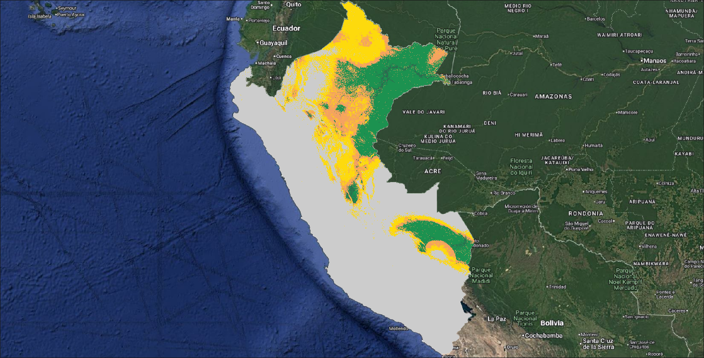
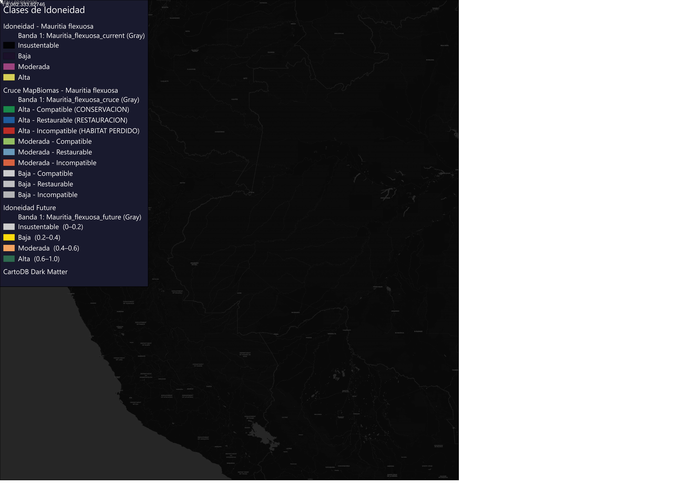

# Memoria Técnica - Premio MapBiomas Perú 2026

## 1. Título del Proyecto
**ENM-Amazonía: Modelado de Nicho Ecológico y Prioridades de Conservación para el Aguaje (*Mauritia flexuosa*) mediante la integración de idoneidad climática y uso del suelo (MapBiomas Perú 2024).**

## 2. Autor(es)
Darío Nicolás Sánchez Leguizamón (Beca BIEI 2025 | Proyecto ARG/19/G24 | Red ARGENA)

## 3. Resumen Ejecutivo
La Amazonía peruana experimenta transformaciones territoriales aceleradas, poniendo en riesgo especies clave como el Aguaje (*Mauritia flexuosa*), cuyo hábitat sufre degradación por deforestación y cambio climático. Este trabajo presenta un *pipeline* automatizado en R y Python que cuantifica el impacto humano y climático sobre esta especie.

Utilizando algoritmos de aprendizaje automático (Ensemble Modeling) y proyecciones de cambio climático (CMIP6, SSP2-4.5), el proyecto estima la idoneidad ambiental de *Mauritia flexuosa*. El principal aporte innovador consiste en el **cruce algebraico y espacial (raster math)** de esta idoneidad climática con las categorías oficiales de uso del suelo de **MapBiomas Perú 2024 (Colección 3)** a 30 metros de resolución. Esto permite segregar las áreas climáticamente aptas en tres ejes críticos para la gestión territorial: áreas compatibles (prioridad de conservación), áreas restaurables (silvicultura/pasturas) y hábitat irreversiblemente perdido (minería/urbano/agricultura intensiva). Los resultados se publican a través de cartografía automatizada de alta calidad y visores interactivos web.

## 4. Problema que Resuelve (Relevancia)
El planeamiento territorial moderno no puede depender únicamente de los modelos de nicho ecológico "teóricos" que ignoran la realidad del terreno. Saber que un área es "climáticamente perfecta" para el Aguaje no es útil si en la actualidad ese píxel está ocupado por un área minera o urbana. 

Al integrar los datos de MapBiomas Perú 2024, este estudio resuelve el problema de la **"idoneidad teórica vs disponibilidad real"**, transformando un modelo climático abstracto en una herramienta de políticas públicas que identifica exactamente *cuántos kilómetros cuadrados* de hábitat están disponibles para conservación inmediata, cuántos necesitan restauración y cuántos ya están perdidos.

## 5. Metodología y Uso de Datos de MapBiomas Perú
El procesamiento está codificado de manera reproducible e incluye los siguientes pasos:

1. **Datos de Presencia y Variables Climáticas:** 
   Se emplean registros de biodiversidad (GBIF/iNaturalist) depurados mediante *thinning* espacial (1 registro/píxel) para evitar sesgos. Las variables ambientales provienen de WorldClim v2.1 y topografía SRTM, reducidas mediante análisis VIF (Factor de Inflación de Varianza) $\le 5$ para eliminar colinealidad.
   
2. **Modelado de Nicho Ecológico (Ensemble Modeling):**
   Se entrenan cinco algoritmos (GLM, GBM, RF, MAXNET, XGBOOST) en R (`biomod2`). Se filtran los modelos con métricas superiores (TSS $\ge 0.7$ y AUCroc $\ge 0.9$) para generar un ensamble final, proyectado tanto para el presente como para el futuro (2050, escenario SSP2-4.5).

3. **Integración con MapBiomas Perú 2024 (La Innovación Central):**
   La capa raster de uso de suelo (`2024_coverage_lclu_16-1-1_4334c236.tif`) se reclasifica en tres grandes dimensiones operativas para la especie:
   - **Compatible:** Bosques, formaciones inundables, humedales, vegetación natural.
   - **Restaurable:** Pasturas, silvicultura, mosaicos agropecuarios.
   - **Incompatible (Pérdida):** Minería, zonas urbanas, agricultura intensiva.
   
   Luego, se realiza un remuestreo espacial interpolado y una superposición (*mask* y suma algebraica) con el raster de Idoneidad Climática reclasificado (Alta, Moderada, Baja/Insustentable). 

4. **Automatización Cartográfica (Layouts Premium QGIS):**
   Un script programado en Python (`qgis_layout_mauritia.py`) procesa automáticamente los estadísticos de superficie cruzada (km²) y emite layouts cartográficos de nivel *premium*, incorporando tipografía moderna, barras de progreso dinámicas, sombras y escalas, estandarizando los reportes de resultados sin intervención manual.

## 6. Resultados y Conclusión
La metodología desarrollada logra aislar la métrica más importante para los conservacionistas: la **Alta Idoneidad Climática Compatible**. 

A través de las tablas generadas por el script `BLOQUE7_mapbiomas.R`, el usuario final puede obtener los kilómetros cuadrados exactos de hábitat remanente, áreas de transición aptas para restauración e impacto antropogénico cuantificado, consolidando el papel estratégico de la base de datos de MapBiomas Perú 2024 como el pilar fundamental para aterrizar modelos climáticos predictivos en escenarios aplicables a la gestión territorial del Estado peruano y ONGs ambientales.

### 6.1. Visualización de Resultados
A continuación se presenta un extracto de los layouts cartográficos automatizados generados por el pipeline, donde se evidencia la integración de la idoneidad climática con el uso de suelo:

Visor interactivo: [`resultados/mapa_interactivo_cruce_peru.html`](./resultados/mapa_interactivo_cruce_peru.html)

---
> **Repositorio de Código Abierto:** El código fuente (R y Python), la lógica de reclasificación de la leyenda MapBiomas y las rutinas de QGIS están disponibles públicamente en este mismo repositorio: [`BLOQUE7_mapbiomas_peru.R`](./BLOQUE7_mapbiomas_peru.R).
